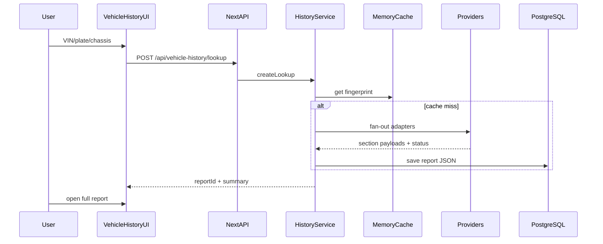

# Vehicle History — System Architecture

## Placement

Модуль живёт **внутри HayMarket** (`/vehicle-history`), общие auth/Prisma/UI tokens.

```
haymarket/
├── docs/vehicle-history/          # Product + architecture docs
├── prisma/schema.prisma           # VehicleHistory* models
├── src/modules/vehicle-history/   # Domain services + providers
├── src/app/api/vehicle-history/   # Public + partner APIs
├── src/app/[locale]/vehicle-history/
└── src/components/vehicle-history/
```

## High-level flow



## Modules

| Module | Responsibility |
|--------|----------------|
| `normalize` | VIN/plate/chassis cleanup + fingerprint |
| `providers/*` | External/internal data adapters |
| `history.service` | Orchestration, merge, persist |
| `access` | Ownership, paid unlock, API keys |
| `audit` | Request logs for admin/partners |

## Target scale stack (roadmap)

MVP: Next API + Prisma + Postgres (current).  
Scale: optional Upstash Redis (`vh:fp:{fingerprint}`, FREE merge only, TTL 1h), BullMQ for slow providers, S3 PDF export, Elasticsearch for plate/VIN search, Nest worker process.

## Security

- Rate limit lookups per IP/user
- Partner API key + HMAC optional
- PII (owner names) never in free preview
- Audit log of who requested what
- No secrets in client
- Redis fingerprint cache stores FREE provider-merge JSON only — never PAID payloads for cross-user reuse

## Roadmap

1. [x] **MVP:** search UI, report shell, VIN decode, HayMarket matches, CTA on listing, schema, docs  
2. [x] **Billing:** paid unlock of full report (owner-only enrichment)  
3. [x] **Admin + ЛК:** my reports, audit log, partner keys, lookup stats  
4. [x] **Partner API docs** + stub / key management UI  
5. [x] **Print / PDF:** HTML `window.print()` on report view  
6. [~] **Redis cache hook:** optional Upstash FREE fingerprint cache before DB create (queues / S3 PDF later)  
7. [ ] **Provider contracts:** customs / insurance / police B2B  
